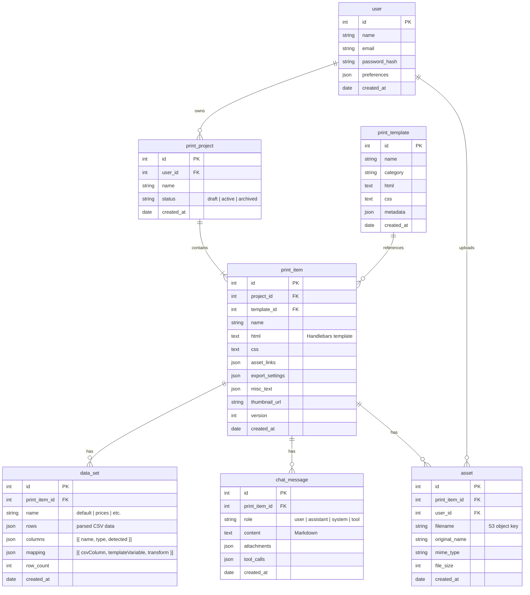

```mermaid
erDiagram
    user ||--o{ print_project : owns
    print_project ||--|{ print_item : contains
    print_template ||--o{ print_item : references
    print_item ||--o{ data_set : has
    print_item ||--o{ chat_message : has
    print_item ||--o{ asset : has
    user ||--o{ asset : uploads

    user {
        int id PK
        string name
        string email
        string password_hash
        json preferences
        date created_at
    }
    print_project {
        int id PK
        int user_id FK
        string name
        string status "draft | active | archived"
        date created_at
    }
    print_item {
        int id PK
        int project_id FK
        int template_id FK
        string name
        text html "Handlebars template"
        text css
        json asset_links
        json export_settings
        json misc_text
        string thumbnail_url
        int version
        date created_at
    }
    print_template {
        int id PK
        string name
        string category
        text html
        text css
        json metadata
        date created_at
    }
    data_set {
        int id PK
        int print_item_id FK
        string name "default | prices | etc."
        json rows "parsed CSV data"
        json columns "[{ name, type, detected }]"
        json mapping "[{ csvColumn, templateVariable, transform }]"
        int row_count
        date created_at
    }
    chat_message {
        int id PK
        int print_item_id FK
        string role "user | assistant | system | tool"
        text content "Markdown"
        json attachments
        json tool_calls
        date created_at
    }
    asset {
        int id PK
        int print_item_id FK
        int user_id FK
        string filename "S3 object key"
        string original_name
        string mime_type
        int file_size
        date created_at
    }
```
